---
tags:
  - Инструкция
  - MS Word
  - Exsel
---

# 📄📊 MS Word и Excel

## 👤 Настройка имени пользователя

Чтобы изменить имя пользователя в Word, необходимо:

* Открыть Word и перейти во вкладку «Файл».

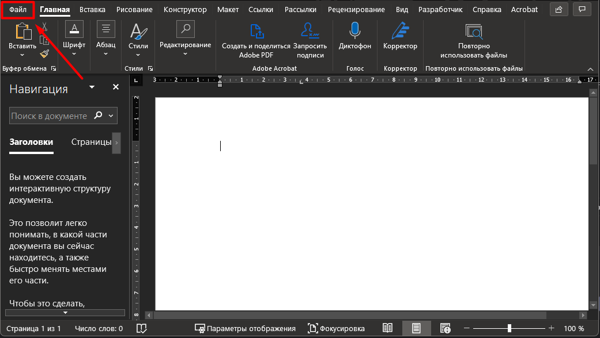

* Перейти в раздел «Параметры».

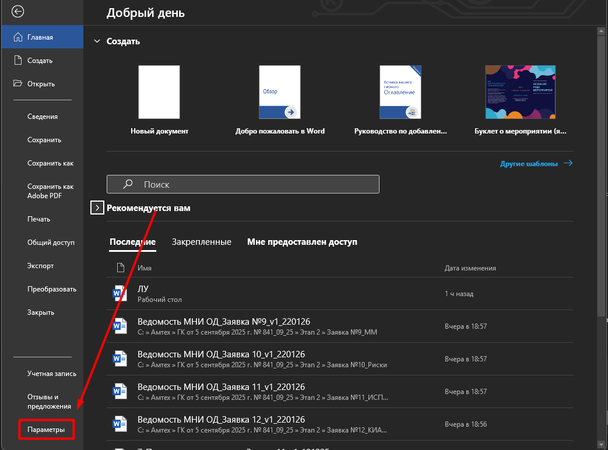

* В подразделе «Общие» (1) в пункте «Личные настройки Microsoft Office» (2) в полях «Имя пользователя» и «Инициалы» указать свои инициалы и нажать нопу «Ок» (3).

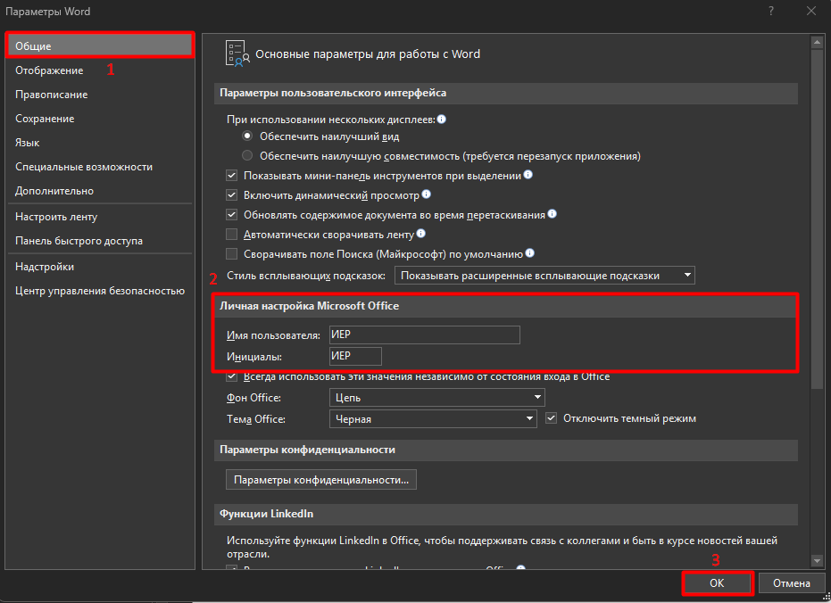

В результате в примечаниях и в информации об авторе изменений будут отображаться только инициалы.

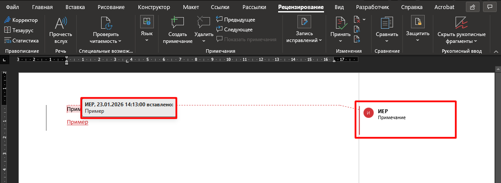

## ➕📄 Добавление поля с общим количеством страниц документа

Чтобы на титульном листе вставить поле с общим количеством страниц документа, исключая первый лист утверждения (ЛУ), необходимо выполнить действия:

* **Поставить курсор** в то место документа, где должно отображаться количество страниц.

* Нажать сочетание клавиш **Ctrl + F9** – появится пустое поле:

***
>{    }
***

* Внутри этих скобок ввести сначала знак «=», затем **снова нажать Ctrl + F9** – получится:

***
>{ ={ } }
***

* Внутри **внутренних** скобок ввести «NUMPAGES»:

***
>{ ={ NUMPAGES } }
***

* После внутреннего поля добавить пробел и «-1» (минус одна страница):

***
>{ ={ NUMPAGES } -1 }
***

* Убедиться, что **нет лишних пробелов или символов**.

* Нажать **F9**, чтобы обновить поле.

Должно появиться число: общее количество страниц минус 1.

## 🔗🖼️📊 Добавление перекрестных ссылок на рисунки/таблицы

При добавлении перекрёстной ссылки на рисунок и таблицу необходимо вставлять только номер, исключая автоматически генерируемые слова *Рисунок*, *Таблица*.

=== "📋 Способ 1. С помощью главного меню"

    * Во вкладке **«Ссылки»** (1) выбрать **«Перекрёстная ссылка»** (2).

    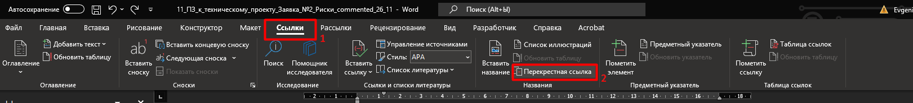

    * В поле **«Тип ссылки»** выбрать элемент **«Рисунок»**, в поле **«Вставить ссылку на:»** выбрать **«Постоянная часть и номер»**, в поле **«Для какого значения:»** указать рисунок, на который хотим сослаться, и нажать кнопку **«Вставить»**.

    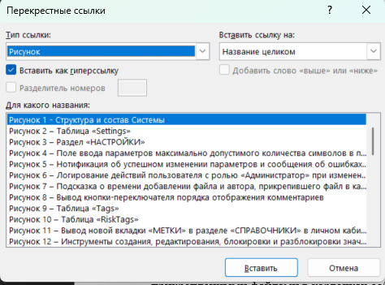

    * Навести указатель мыши на добавленную ссылку, правой кнопкой мыши вызвать меню и выбрать **«Изменить поле»**.

    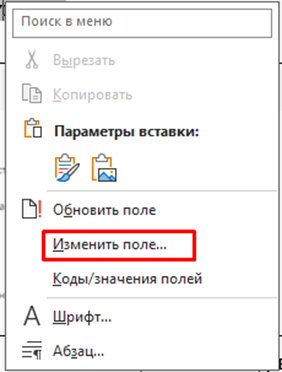

    * В открывшемся окне нажать кнопку **«Коды поля»**.

    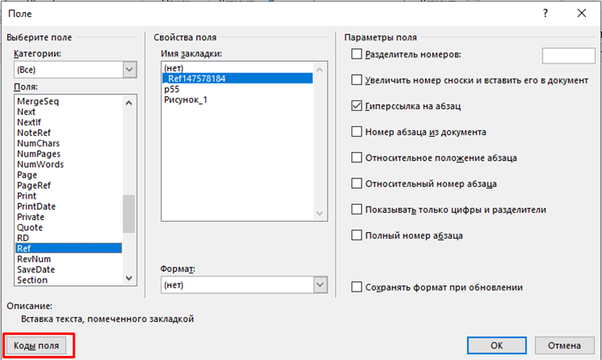

    * В поле (1) «Коды поля» добавить символы **`\#\0\h`**, проставить отметку в чек-боксе «Сохранить формат при обновлении» (2) и нажать кнопку «Ок» (3). Слово «Рисунок» из перекрестной ссылки удалится.

    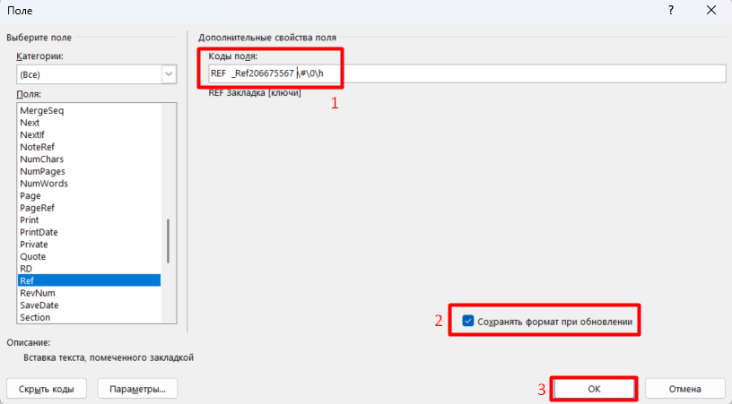

    ***
    !!! note "Примечание"
        Если при открытии кода поля видим, что код **`\h`** уже прописан, добавляем соответственно только **`\#\0`**.
        Код **`\h`** говорит о том, что ссылка вставлена как гиперссылка.
    ***

=== "⌨️ Способ 2. С помощью горячих клавиш"

    * После добавления перекрестной ссылки навести курсор на ссылку и нажать **Shift+F9**, при этом в тексте вместо ссылки отобразится код поля.

    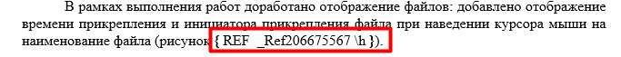

    * Аналогичным образом добавить в код поля  **`\#\0\h`** и нажать клавишу **F9**. При этом ссылка обновится и останется только номер рисунка.

    ***
    !!! note "Примечание"
        Если при открытии кода поля видим, что код **`\h`** уже прописан, добавляем соответственно только **`\#\`0**.
        Код **`\h`** говорит о том, что ссылка вставлена как гиперссылка.
    ***

## ⚙️📑 Настройка содержания

***
!!! warning "Важно!"
    Для корректного формирования содержания необходимо, чтобы заголовки разделов были оформлены с использованием встроенных стилей Word и включали автоматическую нумерацию.
    
    Рекомендуется использовать для заголовков встроенные стили («Заголовок 1», «Заголовок 2», «Заголовок 3»), настроив их по требованиям ГОСТ.

!!! info "Требования ГОСТ 2.105-2019 к оформлению содержания:"
    6.2.2 В элементе «Содержание» приводят порядковые номера и заголовки разделов (при необходимости – подразделов) данного ТД, обозначения и заголовки его приложений. При этом после заголовка каждого из указанных структурных элементов ставят отточие, а затем приводят номер страницы ТД, на которой начинается данный структурный элемент.

    6.2.3 В элементе «Содержание» номера подразделов приводят <u>после абзацного отступа, равного двум знакам, относительно номеров разделов</u>.

    6.2.4 В элементе «Содержание» при необходимости продолжения записи заголовка раздела или подраздела на второй (последующей) строке его начинают на уровне начала этого заголовка на первой строке, а при продолжении записи заголовка приложения — на уровне записи обозначения этого приложения.

    6.2.5 Элемент «Содержание» размещают после предисловия ТД, начиная с новой страницы. При этом <u>слово «Содержание» записывают в верхней части этой страницы, посередине, с прописной буквы и выделяют полужирным шрифтом</u>.

!!! warning "Важно!"
    Рекомендуется включать в оглавление не более трёх уровней заголовков.
***

Для настройки содержания в документе необходимо:

* Установить курсор на листе, где требуется вставить содержание.

* Перейти во вкладку «Ссылки» (1) → «Оглавление» (2) и выбрать пункт «Настраиваемое оглавление» (3):

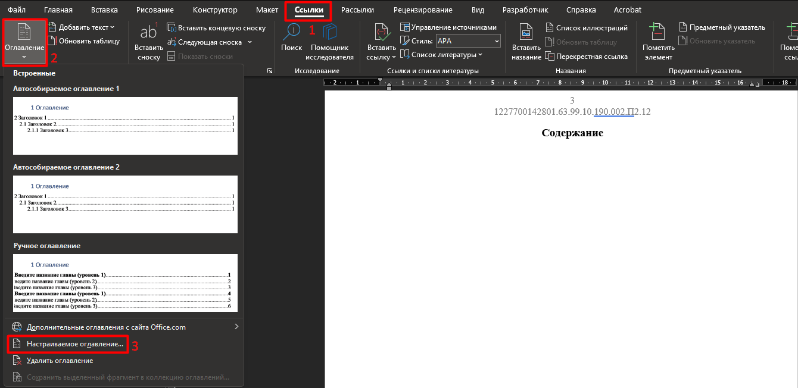

* В открывшемся окне «Оглавление»:

    1. заполнить значения: 

        1. поставить отметку в чек-боксе «Показать номера страниц»;

        1. поставить отметку в чек-боксе «Номера страниц по правому краю»;

        1. поставить отметку в чек-боксе «Гиперссылки вместо номеров страниц»;

        1. в поле «Заполнитель» выбрать выбрать точки;

        1. в поле «Форматы» выбрать «Из шаблона»;

        1. в поле «Уровни» указать значение 3;

    1. нажать кнопку «Параметры».

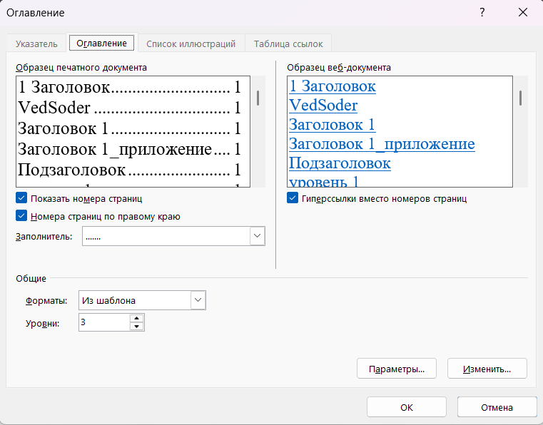

* В открывшемся окне «Параметры оглавления» с помощью кнопки «Сброс» (1) сбросить выставленные автоматически уровни для стилей и настроить их вручную:

    1. для стиля «Заголовок 1» указать уровень 1 (2);

    1. для стиля «Заголовок 2» указать уровень 2 (3);

    1. для стиля «Заголовок 3» указать уровень 3 (4);

    1. для стиля приложения указать уровень 4 (5).

    Нажать кнопку «Ок» (6).

***
!!! warning "Важно!"
    Несмотря на то, что приложение в содержании должно отображаться как элемент первого уровня, для стиля заголовка приложения необходимо назначить **уровень, не используемый в основной структуре документа**.
    
    Например, если в документе задействованы уровни 1–3, для приложения следует использовать **уровень 4**. Это требуется для корректной настройки выступа (отступа) в автоматически сформированном содержании.
***

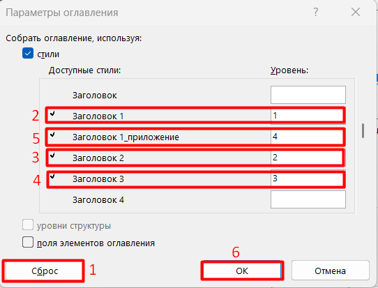

* Далее необходимо настроить стиль для каждого уровня оглавления. В окне «Оглавление» нажать кнопку «Изменить»:

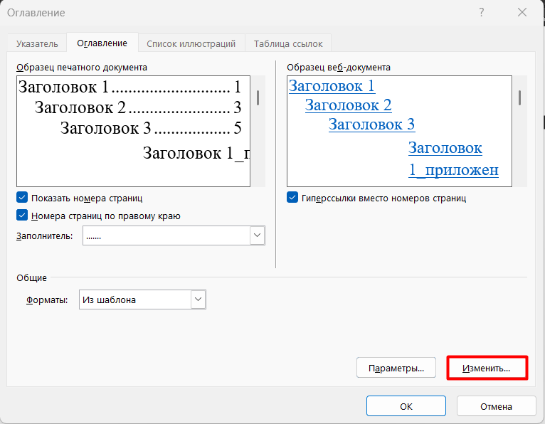

* В открывшемся окне выбрать стиль «Оглавление 1» (1) и нажать кнопку «Изменить» (2):

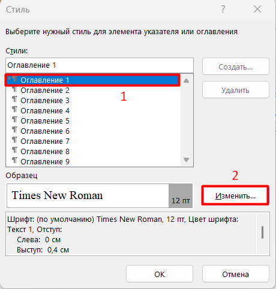

* В открывшемся окне «Изменение стиля» указать:

    1. свойства (1):

        1. Имя – указать «Оглавление 1»;

        1. Стиль – выбрать из выпадающего списка «Абзац»;

        1. Основан на стиле – выбрать из выпадающего списка «(нет)»;

        1. Стиль следующего абзаца – выбрать из выпадающего списка стиль, используемый для основного текста в документе, например, «Обычный»;

    1. форматирование текста (2):

        1. шрифт – Times New Roman;

        1. размер шрифта – 12;

        1. выравнивание – по левому краю;

    1. дополнительные параметры (3):

        1. поставить отметку в чек-боксе «Добавить в коллекцию стилей»;

        1. выбрать вариант использования стиля – «Только в этом документе».

***
!!! note "Рекомендация"
    Всегда **отключайте** функцию «Обновлять автоматически».
    
    Чек-бокс «Обновлять автоматически» управляет поведением стиля при ручном форматировании текста, к которому он применён. Если отметка в чек-боксе «Обновлять автоматически» проставлена, то любое ручное изменение форматирования (шрифт, размер, отступы и т.д.) в абзаце, оформленном этим стилем:

    * автоматически изменит сам стиль;

    * и все другие фрагменты текста с этим стилем обновятся мгновенно.
***

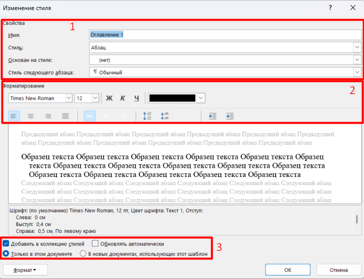

* Нажатием кнопки «Формат» открыть раскрывающийся список и выбрать «Абзац»:

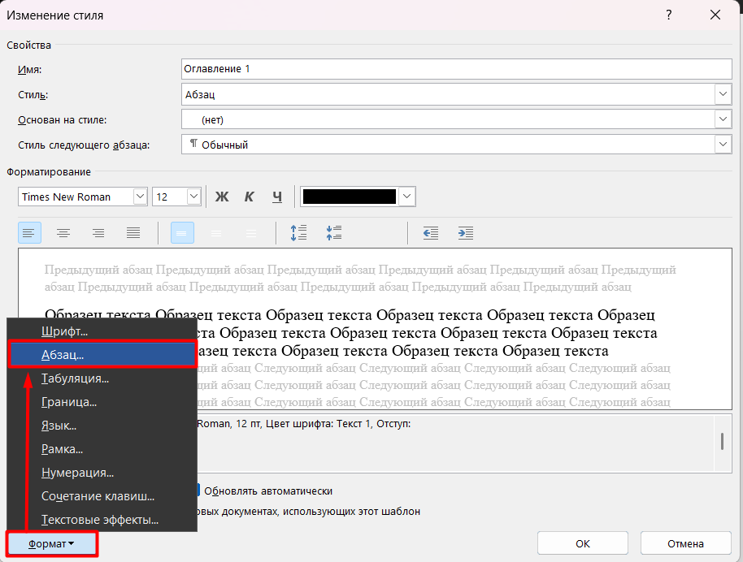

* В открывшемся окне «Абзац» установить значения:

    1. отступ слева – 0;

    1. отступ справа – 0,5 см;

    1. выступ – 0,4 см;

    1. интервалы Перед и После – 0;

    1. междустрочный интервал – одинарный.

    Нажать кнопку «Ок»:

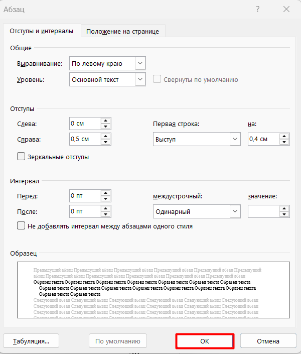

* Нажатием кнопки «Формат» открыть раскрывающийся список и выбрать «Табуляция»:

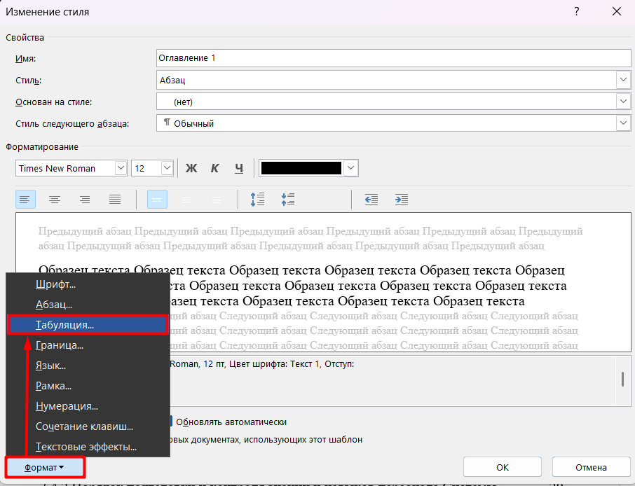

* В окне «Табуляция»:

    1. с помощью кнопки «Удалить все» удалить все имеющиеся значения табуляции и установить значение **16,8 см**;

    1. выравнивание – «По правому краю»;

    1. заполнитель – 2.....;

    1. нажать кнопку «Ок»:

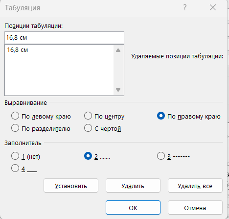

* Сохранить изменения для стиля «Оглавление 1», нажав кнопку «Ок»:

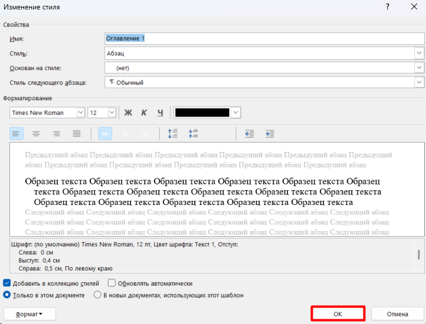

* Повторить шаги 6-12 для стиля «Оглавление 2», за исключением шага 9:

    в окне «Абзац» установить следующие значения:

    1. отступ слева – 0,4 см;

    1. отступ справа – 0,5 см;

    1. выступ – 0,65 см;

    1. интервалы Перед и После – 0;

    1. междустрочный интервал – одинарный.

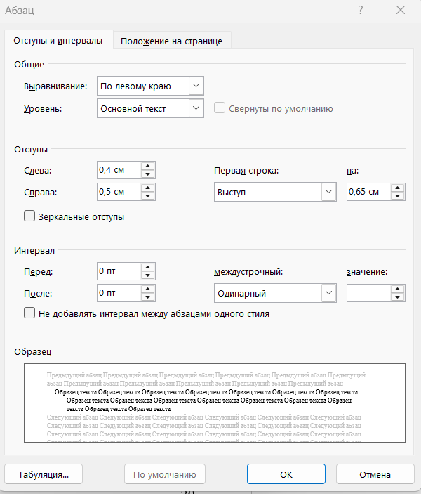

* Повторить шаги 6-12 для стиля «Оглавление 3», за исключением шага 9:

    в окне «Абзац» установить следующие значения:

    1. отступ слева – 1 см;

    1. отступ справа – 0,5 см;

    1. выступ – 1 см;

    1. интервалы Перед и После – 0;

    1. междустрочный интервал - одинарный.

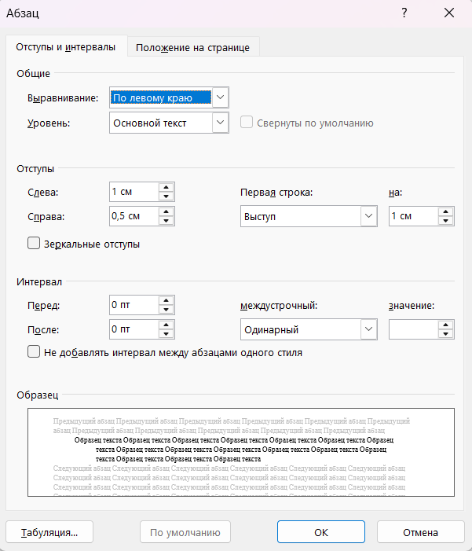

* Повторить шаги 6-12 для стиля «Оглавление 4»(стиль заголовка приложения), за исключением шага 9:

    в окне «Абзац» установить следующие значения:

    1. отступ слева – 0;

    1. отступ справа – 0,5 см;

    1. выступ – 2,7 см;

    1. интервалы Перед и После – 0;

    1. междустрочный интервал – одинарный.

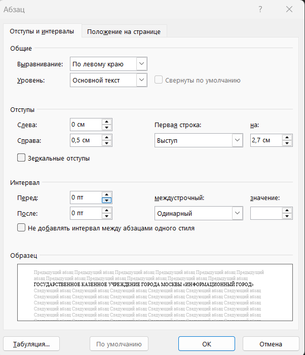

* После настроек всех стилей сохранить изменения, нажав кнопку «Ок» в окне «Стиль», а затем в окне «Оглавление»:

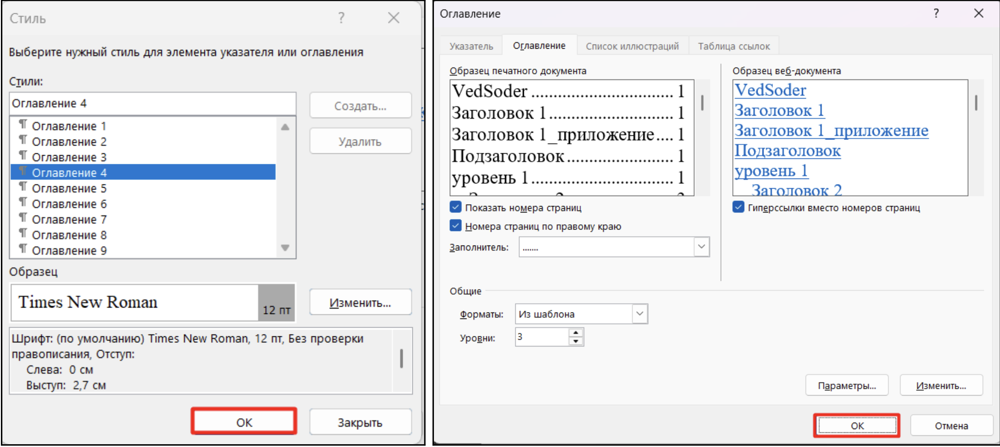