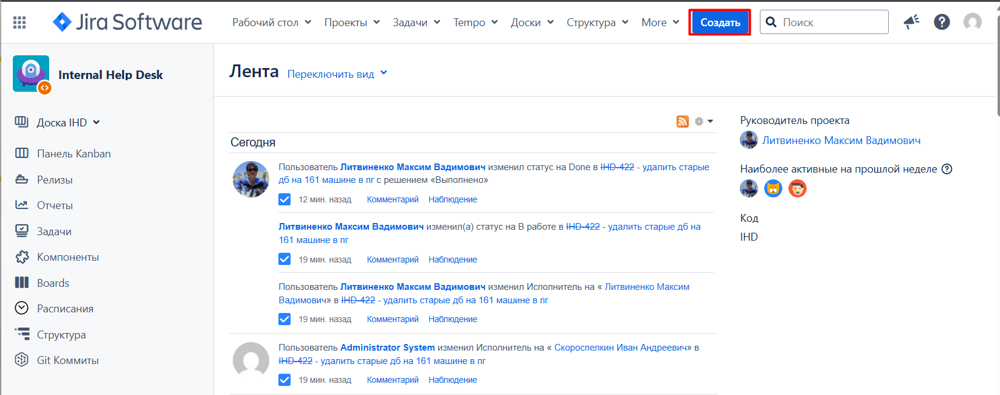
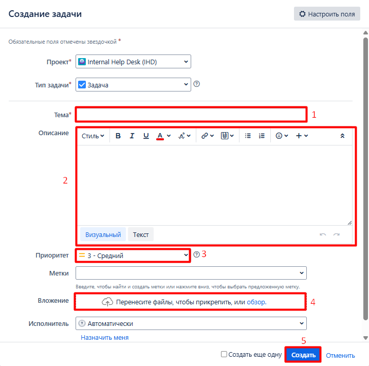
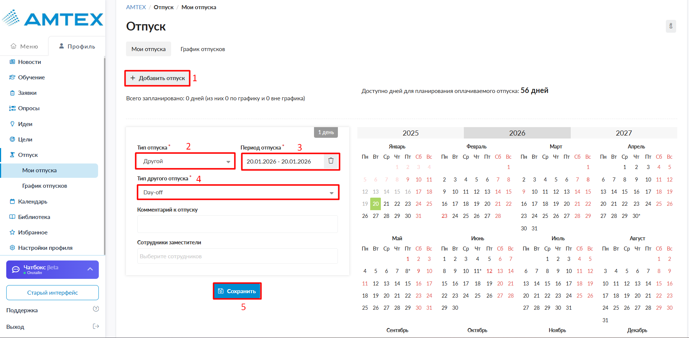
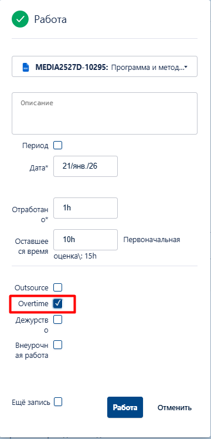

---
tags:
  - OnBoarding
  - Day-Off
  - Overtime work
---
# 🚀 OnBoarding
## ⏳ Испытательный срок

Испытательный срок длится **3 месяца**. После прохождения испытательного срока HR-менеджер организует встречу, чтобы обсудить твои результаты.

Если испытательный срок пройден успешно, через пару недель тебе на электронную почту поступит полис ДМС.

Более подробно про ДМС и другие компенсации и льготы в компании тебе на встрече расскажет HR-менеджер.

## 👩🏻‍💻 О компании

Информация для новых сотрудников АМТЕХ представлена на портале HRBOX по [ссылке 🔗](https://amtech.hrbox.io/page/catalog?hash_id=38db1ec210) .

## 📦 Внутренние ресурсы

|Название| Описание|
|:-:|:-|
|🎯 Jira| Здесь мы ведем свои задачи и логируем время|
|📚 Confluence| Внутренняя база знаний|
|✉️ Zimbra| Электронная почта для учетной записи Амтех|
|📧 Outlook в Интернете |Электронная почта для учетной записи ООО «Инновация-ИТ»|
|✈️ Telegram |Всем известный мессенжер, используем для коммуникаций с командой|
|🏢 eXpress |Внутренний мессенджер с официальным каналом и аккаунтами сотрудников Амтеха|

**Учетная запись** для Jira, Confluence, электронной почты создается системным администратором и выдается в **первый день** трудоустройства.

Для получения электронной почты Outlook обратись к руководителю.

### 🛠️ Доступ к ресурсам и техническая поддержка

В случае возникновения трудностей при работе с **Jira** или **Confluence** – например, требуется предоставить доступ к пространству, изменить статус задачи или при возникновении других проблем (от сбоев в работе оборудования до помощи с принтерами, VPN и другими техническими вопросами) – необходимо создать запрос на портале [**Internal Help Desk** 🖥️](https://jira.msk.ru/projects/IHD/summary).

Чтобы создать задачу необходимо:

* перейти на портал [**Internal Help Desk** 🖥️](https://jira.msk.ru/projects/IHD/summary);

* нажать кнопку «**Создать**»:

* в карточке задачи **заполнить поля**:

    (1) указать тему – кратко сформулировать зарос, например, «*Предоставить доступ*»;

    (2) подробнее описать запрос, проблему, например привести ссылку страницы, к которой нужен доступ;

    (3) указать приоритет – если задача не горящая, указываем «средний»;

    (4) при необходимости привести вложения, например, приложить скриншот;

* нажать кнопку «**Создать**»:

После создания задача отображается в ленте, где можно отслеживать текущий статус её выполнения.

### 🎯 Jira

Каждый день необходимо списывать **8** рабочих часов.

Если не успели списать время за предыдущую неделю и **период уже закрыт**, необходимо создать заявку (см. предыдущий пункт) на списание, [**здесь** ✍🏻](https://jira.msk.ru/projects/IHD/summary).

***
!!! warning "Внимание"
    Запись о работе удалить **нельзя**. Можно только отредактировать количество часов или перенести запись на другой день. Если нужно удалить, необходимо создать заявку (см. предыдущий пункт) на удаление [**здесь** ✍🏻](https://jira.msk.ru/projects/IHD/summary).
***

## 📄 Настройка Word для работы с комментариями

При работе с документами в режиме рецензирования Word автоматически подписывает все комментарии и правки именем пользователя, заданным в настройках программы.

Однако в нашей компании действует требование: в примечаниях и комментариях к документам не должно содержаться персональных данных, включая имя и фамилию автора. Это связано с необходимостью соблюдения Федерального закона № 152-ФЗ «О персональных данных», который регулирует обработку и распространение такой информации.

Чтобы избежать случайного размещения персональных данных в документах, необходимо в Word **изменить** имя пользователя, чтобы в комментариях отображались только ваши инициалы (например, «*И.О.*»). Это позволит сохранять возможность совместной работы и обратной связи, оставаясь в рамках корпоративной политики и законодательства.

## ☀️ Day-Off

### ⛱️ Что такое Day-off?

***
!!! info "Информация"
    Информация взята с корпоративного портала HRBOX (актуальна на январь 2026 г.).

    > 📌 Источник: [Day-off для сотрудников AMTEX 🔗](https://amtech.hrbox.io/read/8289fe63aa/day-off?category_id=88258afc-da29-4899-8eb8-667e827a88de)
***

Сотрудники компании, которые успешно прошли испытательный срок, получают право на **2 дополнительных дня отдыха в год - Day-off**.

* Day-off является **оплачиваемым** днем отдыха.

* 2 дня day-off начисляются на **календарный год**.

* Неиспользованные в календарном году day-off **сгорают**.

***
!!! warning "Внимание"
    Перед созданием заявки необходимо **предварительно уведомить** непосредственного руководителя о намерении использовать day-off с указанием даты, а также **сообщить администратору проекта**, чтобы он создал подзадачу для списания времени.
***

Для новых сотрудников, принятых в компанию, начисляется **1-й день day-off** после прохождения испытательного срока (через **3 месяца** работы) и **2-й день day-off** спустя **6 месяцев** работы в компании.

### 📋 Как оформить Day-off?

Чтобы оформить Day-off необходимо:

* перейти на портал [HRBOX 🖥️](https://amtech.hrbox.io);

* на главной странице портала перейти во вкладку «**Профиль**» и выбрать раздел «**Отпуск**» → «**Мои отпуска**»:

* в разделе «**Мои отпуска**»:

    (1) нажать кнопку «+Добавить отпуск»;

    (2) выбрать типа отпуска «Другой»;

    (3) указать период отпуска, например, 20.01.2026-20.01.2026, если оформляем один день;

    (4) выбрать тип другого отпуска «Day-off»;

    (5) нажать кнопку «Сохранить».

Комментарий к отпуску **не обязателен**. При необходимости можно выбрать коллегу, который будет замещать тебя на период отсутствия.

***
!!! warning "Внимание"
    После нажатия кнопки «Сохранить» заявка на отпуск сразу направляется на согласование.
***

## 💼 Работа в выходной день

Иногда производственная необходимость требует выполнения задач в выходные или нерабочие праздничные дни.

***
!!! warning "Внимание"
    Работа в выходные дни оформляется заранее.
***

1. Ведущий технический писатель создает заявку на работу в выходной день **не позднее 13:00 ч мск в пятницу** той недели, в которую планируется привлечение к работе.

2. В заявке указывается:

    1. дата выходного дня, в который планируется выполнение работы;

    2. конкретная задача или задачи в Jira, подлежащие выполнению;

    3. обоснование необходимости выполнения именно в выходной день;

    4. планируемое количество часов, необходимых для выполнения задачи.

3. После выполнения работы в выходной день технический писатель должен:

    1. списать время в Jira на ту задачу, которая была указана в **согласованной заявке**;

    2. указать объём списываемого времени в **двойном размере** по сравнению с фактически затраченным. Например, если на выполнение задачи ушло 5 часов, в Jira необходимо списать 10 часов (5 × 2);

    3. отметить работу как сверхурочную — в карточке задачи в Jira необходимо **проставить отметку в чек-боксе «Overtime»** (см. рисунок ниже);

    4. **Не превышать объём** списываемого времени относительно запланированного в заявке.
    Например, если в заявке указано 6 часов, но фактически потрачено 7 часов, списать можно не более 12 часов (6 × 2). Превышение требует отдельного согласования.

## 📖 Полезные материалы

* 📝 «[Пиши, сокращай. Как создавать сильный текст](static/Ильяхов%20М.,%20Сарычева%20Л.%20Пиши,%20сокращай.%20Как%20создавать%20сильный%20текст.pdf "Скачать книгу в PDF"){:download="Пиши, сокращай. Как создавать сильный текст.pdf"}» – Ильяхов М., Сарычева Л.

* ✉️ «[Новые правила деловой переписки](https://psv4.userapi.com/s/v1/d/KT8Nu3T4Lctdt1CwLDGZOphmNAov16Q--07rBXYWcd_-BQS-gokVO_ZR92z6aKgjn2BfmbpWR_xnAB_FjFRnTKBEDdgB3CO5Bw0_jy9Ae2kW206O8I8X6A/Ilyakhov_Novye_pravila_delovoi_774_perepiski.pdf "Читать защищенный pdf в окне браузера")» – Ильяхов М., Сарычева Л.

* 💬 «[Слово живое и мертвое](static/Нора%20Галь%20Слово%20живое%20и%20мертвое.pdf "Скачать книгу в PDF"){:download="Слово живое и мертвое.pdf"}» – Нора Галь.

* 🌿 «[Живой как жизнь (Рассказы о русском языке)](static/Чуковский%20К.%20Живой%20как%20жизнь%20(рассказы%20о%20русском%20языке).pdf "Скачать книгу в PDF"){:download="Живой как жизнь (Рассказы о русском языке).pdf"}» – Чуковский К.И.

* 🧠 «[Парадокс перфекциониста](static/ТАЛ%20БЕН-ШАХАР%20Парадокс%20перфекциониста.pdf "Скачать книгу в PDF"){:download="Парадокс перфекциониста.pdf"}» – ТАЛ БЕН-ШАХАР. Если вы уже три раза перечитываете это предложение в поисках «идеальной формулировки» — эта книга точно для вас.