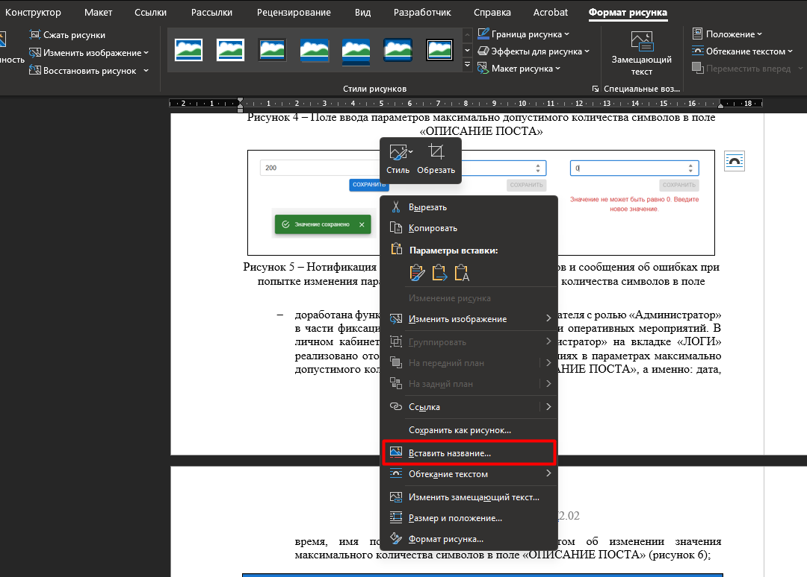

---
tags:
  - Инструкция
  - Документация
  - MS Word
---

# 📋 Редполитика документации
## 🎨 Стиль

✅ В инструкциях (РП и РА) **рекомендуется** использовать:

* обезличенные формулировки (*необходимо выбрать*, *следует нажать*, *требуется*, *рекомендуется*);

* каждый шаг должен начинаться с глагола действия (*нажать*/*перейти*/*выбрать*/*выполнить*/etc) и только после него следует писать пояснения к действию (то есть следует писать не «*В адресной строке ___ввести___...*», а «*___Ввести___ в адресной строке...*»);

* общепринятые сокращения (например, **т.к.**, **т.д.**);

* буквы «Ё», «ё» без точек, в том числе в именах собственных. Если название элемента интерфейса содержит букву «ё», в документации пишем название, как в интерфейсе, но в описании элемента пишем «**Е**», «**е**».

❌ При подготовке документов **НЕ** используется:

* повелительное наклонение в инструкциях (*Нажите кнопку*);

* личное обращение к читателю: «*Вы*», «*Ваш*»;

* сокращения слов, кроме установленных правилами русского языка и соответствующим
разделом документа;

* различные научно-технические термины, близкие по смыслу, для одного и того же понятия.

## 🚫 Стоп-слова

|Недопустимое слово/выражение|На что заменить|
|:-:|:-:|
|Хлебные крошки|Кнопка меню|
|Функционал|Функциональность/Функция|
|Кликнуть|Нажать|
|Кликабельный|Интерактивный/Гиперссылка|
|Иконка|Графический элемент/Пикограмма|

Запрещенные слова и выражения, которые нельзя использовать при описании функциональности Подсистемы анализа и обработки событий (Риски) приведены по [ссылке 🔗](https://confluence.msk.ru/pages/viewpage.action?pageId=1104829715 "Запрещенные слова в документации").

## 💡 Примечания и важная информация
### 📌 Примечания

Примечаниями оформляется информацию, которая дополняет основную информацию, но является некритичной для понимания работы Системы. Например то, что понятно из интерфейса, но все равно хочется указать, или просто поясняющие данные к предыдущему тексту.

Как оформляем примечания:

* Если примечание одно, то после слова «Примечание» через тире пишется текст с прописной буквы.

***
!!! note "Одно примечание"
    Примечание – Можно не обращать внимание на эту информацию.
***

* Если примечаний несколько, их нумеруют по порядку.

***
!!! note "Несколько примечаний"
    Примечания:

    1. Можно не обращать внимание на эту информацию.
    
    2. Повторяю, можете идти дальше.
***

### ❗ Важная информация

Важная и критически важная информация выделяется с помощью дисклеймеров:

* «**Важно!**» – выделяет критически значимую информацию, необходимую для правильного выполнения задач, т.е. содержит ключевые моменты, которые следует учесть при работе с Системой;

* «**Внимание!**» – содержит предупреждение о потенциальных рисках и ошибках при выполнении конкретно указанных действий, т.е., информация требует особого внимания и соблюдения указанных рекомендаций во избежание ошибок при работе с Системой.

Слова **Важно!** и **Внимание!** выделяются полужирным. Сама информация пишется обычным текстом.

***
!!! note "Пример выделения важной информации"
    **Важно!** Для настройки доступа к разделу необходимо обратиться к Администратору Системы.
    
    **Внимание!** Если вы решите удалить объект из Системы, то все сломается.
***

## 🧩 Элементы интерфейса
### ✏️ Оформление в тексте

Требования к описанию элементов интерфейса в тексте:

* Названия элементов интерфейса заключаются в **кавычки-елочки** (*кнопка «Сохранить»*).

* Название элемента интерфейса в документе **должно совпадать** с названием элемента в интерфейсе.

* Если в интерфейсе название элемента приведено прописными буквами, в документе оно также пишется **прописными** (*поле «ОПИСАНИЕ ПОСТА»*).

### ✅ Чек-бокс

Рекомендуемые формулировки:

* проставить отметку в чек-боксе «Название» (чаще если чек-бокс один);

* выбрать с помощью чек-боксов (чаще если чек-боксов несколько);

* снять отметку в чек-боксе «Название».

### 🔄 Переключатели (элемент toggle)

Для описания элемента используется слово «**переключатель**».

✅ Рекомендуемые формулировки: 

* активировать переключатель «Название»;

* перевести переключатель «Название» в активное положение;

* перевести переключатель «Название» в неактивное положение.

❌ Неиспользуемые формулировки:

* включить/выключить/отключить переключатель;

* выбрать переключатель.

### 🔘 Радиокнопка (элемент radio button)

Радиокнопка – это элемент графического интерфейса, позволяющий пользователю выбрать один вариант из нескольких взаимоисключающих.

✅ Рекомендуемые формулировки:

* необходимо выбрать один из предложенных вариантов;

* выбрать один из вариантов ниже;

* необходимо переключиться с одного варианта на другой;

* изменить выбранный вариант.

❌ Неиспользуемые формулировки:

* нажать радиокнопку;

* переключить радиобатон.

### 🖲️ Кнопки

При описании кнопок необходимо руководствоваться следующими правилами:

* с кнопками действий используем глагол «**нажать**»;

* слово «кнопка» используется **без** предлога «на» (например: *нажать кнопку «Сохранить»*).

* если кнопка с иконкой и тултипом, используется только **название кнопки**, например: *нажать кнопку «Сохранить»*.

### 🗂️ Панель окна сущности с названием и кнопками

✅ Используемые формулировки: верхняя панель, нижняя панель.

❌ Неиспользуемые формулировки: шапка окна, подвал окна (в **некоторых** проектах можно использовать *шапка* и *подвал*, зависит от проекта и РП).

## 🖼️ Оформление рисунков

* Формат *.jpg, *.png.

* На скриншоте не должно быть персональных данных, бессмысленных или непонятных наборов символов (например, «asdf», «беее-меее» и подобных), а также нецензурных слов.
Если такие элементы присутствуют в интерфейсе, их необходимо либо заблюрить, либо заменить на нейтральные тестовые данные.

* Необходимо добавить рамку.

* Необходимо добавить название рисунка:

    * если на скриншоте показываем окно или отдельный элемент интерфейса, в подписи пишем название окна или элемента, например: *Кнопка редактирования календаря*;

    * если показываем действие, то отглагольное существительное, например: *Копирование календаря*.

* Привести ссылку на рисунок в описании (см. [памятку по вставке перекрестных ссылок 🔗](Instructions_word.md "🔗🖼️📊 Добавление перекрестных ссылок на рисунки/таблицы")).

* Все элементы интерфейса (кнопки, разделы, окна и т.п.), которые требуется показать на скриншоте, должны быть выделены красной рамкой.

* Если на одном скриншоте выделяется несколько элементов, каждый из них должен быть пронумерован (1, 2, 3, …) и описан в тексте.

* В тексте необходимо привести ссылку на каждый пронумерованный элемент.

* Порядок нумерации на скриншоте должен соответствовать порядку упоминания элементов в тексте.

Название рисунка вставляем с помощью функции Word «**Вставить название**»:

